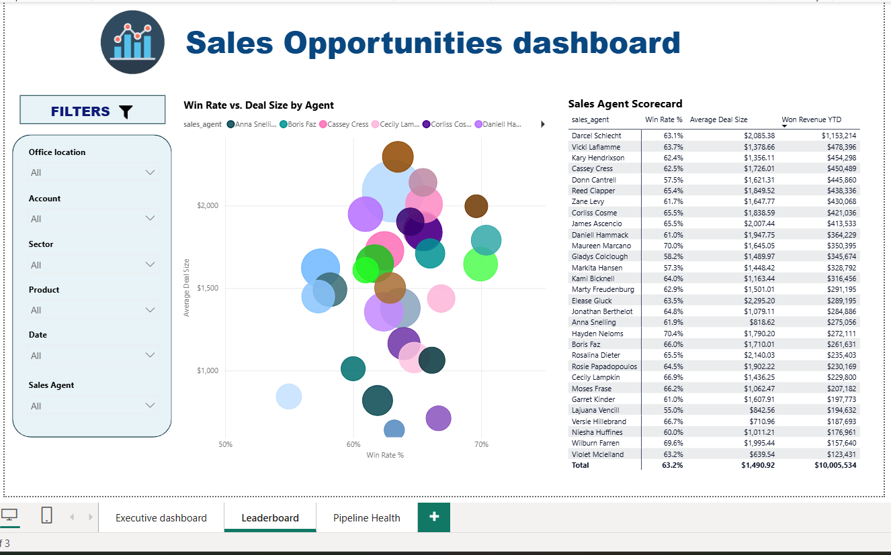
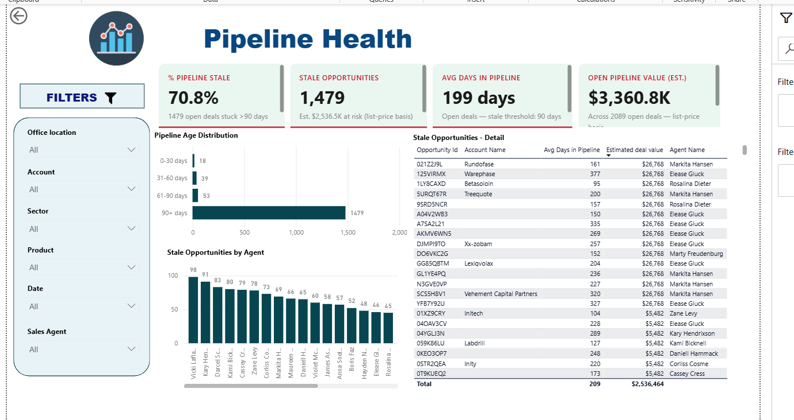

# Sales Opportunities Dashboard — Power BI

A 3-page Power BI dashboard analyzing a B2B sales pipeline — from executive-level performance tracking, to rep-level accountability, to proactive pipeline risk management.


## 🎯 Project Goal

Sales dashboards often stop at "how much did we sell." This project goes further, answering three distinct questions a real sales organization needs:

1. **Executive Dashboard** - How is the business performing right now, and what changed vs. last month?
2. **Leaderboard** - Who is driving that performance, and *how* are they winning (closing lots of small deals vs. landing fewer big ones)?
3. **Pipeline Health** - What risk is sitting in the pipeline that today's revenue numbers don't show?

Most portfolio dashboards only cover #1. Including #3 is what separates a reporting dashboard from an analysis that actually helps a sales leader act.

## 📊 Data Model

Star-schema model built on a B2B sales pipeline dataset:

| Table | Description |
|---|---|
| `sales_pipeline` | Fact table - one row per opportunity (agent, product, account, deal_stage, engage_date, close_date, close_value) |
| `accounts` | Customer accounts (sector, employees, revenue, office location) |
| `products` | Product catalog with list price - used to calculate discounting and to estimate the value of still-open deals |
| `sales_teams` | Sales agents, managers, and regional office mapping |
| Date table | Standard calendar table for time intelligence (MTD, YTD, QTD, YoY) |

**Relationships:** `sales_pipeline` → `accounts` (account), `products` (product), `sales_teams` (sales_agent), Date table (close_date).

## 📈 Page 1 - Executive Dashboard


KPI cards with month-over-month comparisons, color-coded correctly even for "inverse" metrics (a *drop* in discount or loss rate shows green, not red):

- **Won Revenue** - $1,131.6K, +20.5% MoM
- **Avg Won Deal Size** - $2,214
- **Avg Discount %** - 0.7%, calculated against product list price
- **Loss Rate %** - 21.5%

Supporting visuals: opportunity funnel by deal stage, revenue by sector, revenue by office location, monthly revenue trend, revenue by product, and a full opportunity detail table.

**Design note:** the discount % card intentionally shows the percentage-point change alongside the relative % change - a tiny base (0.1% → 0.7%) produces a misleading "+614%" if shown alone, so both figures are shown for honest context.

## 🏆 Page 2 — Leaderboard



- **Win Rate vs. Deal Size by Agent** - a bubble chart (bubble size = Won Revenue YTD) that segments reps by *sales style*, not just rank. It splits the team into natural quadrants: high win-rate closers, big-deal hunters, and reps who may need coaching — a more actionable view than a single ranked list.
- **Sales Agent Scorecard** - a full table (Win Rate %, Average Deal Size, Won Revenue YTD) with consistent sorting and currency formatting, serving as the single source of truth behind the chart.

## ⚠️ Page 3 - Pipeline Health



The proactive-risk page. While pages 1–2 report on what already happened, this page flags what could go wrong next:

- **% Pipeline Stale** - 70.8% of open opportunities have sat for 90+ days
- **Stale Opportunities** - 1,479 deals, with estimated value at risk
- **Avg Days in Pipeline** - 199 days
- **Open Pipeline Value (Est.)** - $3,360.8K across all open deals, valued on a list-price basis since open deals have no closed value yet

Supporting visuals:
- **Pipeline Age Distribution** - a histogram (0–30 / 31–60 / 61–90 / 90+ days) showing staleness isn't a tail-end edge case for this business — it's the norm: 93% of open deals are already 90+ days old.
- **Stale Opportunities by Agent** - surfaces concentration of risk by rep.
- **Stale Opportunities — Detail** - a sortable table of every stale deal (account, days in pipeline, estimated value, owning agent) so a manager can act on individual deals, not just the aggregate.

**Data integrity note:** an early version of this page showed impossible values (3,000+ days in pipeline) because the underlying measure computed age against `TODAY()`. Since this dataset ends in 2017, that produced a ~9-year gap. Every time-based measure on this page instead anchors to `MAX(close_date)` in the dataset, so the metrics reflect the data's own timeline rather than the system clock.

## 🧮 Key DAX Measures

**Time-Intelligence KPI Cards** — reusable pattern used throughout: anchor to the latest date *in the data*, compare current vs. prior period, and render as styled HTML with conditional (and correctly-directional) color coding.

```dax
KPI Card_AvgDealSize =
VAR _AnchorDate = MAX(sales_pipeline[close_date])
VAR _CurMonthStart = DATE(YEAR(_AnchorDate), MONTH(_AnchorDate), 1)
VAR _AvgDeal = CALCULATE([Average Won Deal Size], ...current month...)
VAR _AvgDealPM = CALCULATE([Average Won Deal Size], ...prior month...)
RETURN "<div>...styled HTML KPI card with $ and % variance...</div>"
```

**Pipeline Health measures** - snapshot-based (not MoM, since open deals lack a `close_date` to bucket by month):

```dax
Avg Days in Pipeline (Open Deals) =
VAR _AnchorDate = CALCULATE(MAX(sales_pipeline[close_date]), ALL(sales_pipeline))
RETURN
AVERAGEX(
    FILTER(sales_pipeline, sales_pipeline[deal_stage]<>"Won" && sales_pipeline[deal_stage]<>"Lost"),
    DATEDIFF(sales_pipeline[engage_date], _AnchorDate, DAY)
)

% of Pipeline that's Stale =
VAR _OpenDeals = CALCULATE(COUNTROWS(sales_pipeline), sales_pipeline[deal_stage]<>"Won" && sales_pipeline[deal_stage]<>"Lost")
RETURN DIVIDE([Stale Opportunities], _OpenDeals)
```

**Estimated Deal Value** (calculated column) - fills the gap where `close_value` is blank for open deals, using the product's list price as a clearly-labeled estimate rather than leaving the field blank or fabricating a false "actual" number:

```dax
Estimated Deal Value =
IF(
    ISBLANK(sales_pipeline[close_value]),
    RELATED(products[sales_price]),
    sales_pipeline[close_value]
)
```

**Full measure list** (organized into 3 display folders in the model):
- *Sales Measures:* Total Opportunities, Total Pipeline, Won/Lost Revenue & Deals, Win Rate %, Agent Rank
- *Stakeholder KPIs:* Loss Rate %, Avg Won Deal Size, Avg Discount %, Avg Sales Cycle, Stale Opportunities, % of Pipeline that's Stale, Avg Days in Pipeline, Won Revenue YTD/MTD/QTD/PY/YoY %, Pipeline Value per Agent, Total Account Revenue Potential
- *KPI Cards:* styled HTML cards for every headline metric across all 3 pages

## 🔍 Key Insights
- Won revenue grew 20.5% MoM, but discount % — while still low in absolute terms — grew 614% relative to a near-zero prior-month base, worth monitoring rather than reacting to.
- 100% of stale opportunities sit at the **Engaging** stage, none at Prospecting — pointing to a negotiation/closing bottleneck rather than a lead-qualification problem.
- 93% of all open deals are already 90+ days old — for this pipeline, staleness is the norm, not an exception, which reframes it from an individual-deal issue to a process issue.
- Win-rate and deal-size don't move together — several of the highest win-rate reps close comparatively small deals, while a few reps land big deals less consistently, suggesting different coaching needs per rep rather than a one-size-fits-all approach.

## 🛠️ Tools Used
- Power BI Desktop (data modeling, DAX, report design)
- DAX — time intelligence, dynamic HTML KPI cards, calculated columns for bucketing/estimation
- Star-schema data modeling

## 🚀 Possible Next Steps
- Break out `Accounts` potential vs. actual pipeline coverage (using `Total Account Revenue Potential`) to find under-penetrated large accounts.
- Add YoY view using the already-built `Won Revenue YoY %` measure, to separate seasonal noise from real trend.
- Extend `Estimated Deal Value` with a probability-weighted variant (e.g. by deal_stage) for a more realistic forecast than flat list price.

## 📁 Files
- `opps.pbix` — full Power BI file
- `/data` — sample source data (CSV)
- `/screenshots` — dashboard preview images

---
*Part of a 3-project Power BI portfolio covering Sales, Operations (CIFOT/DIFOT), and Marketing (NPS/CSAT) analytics.*
